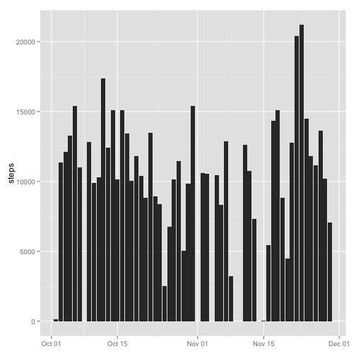

# Reproducible Research: Peer Assessment 1

## Loading and preprocessing the data
### 1
Load the data.

```r
unzip("activity.zip")
data <- read.csv("activity.csv")
```

### 2
Transform data for analysis.

```r
complete <- data[complete.cases(data),]
stepsByDay <- aggregate(steps ~ date, data=complete, FUN=sum)
stepsByInt <- aggregate(steps ~ interval, data=complete, FUN=mean)
stepsByDay$d <- as.Date(stepsByDay$date, format="%Y-%m-%d")
```

## What is mean total number of steps taken per day?
### 1
Histogram of total number of steps taken per day.

```r
library(ggplot2)
ggplot(data=stepsByDay,aes(x=d,y=steps)) + 
    geom_bar(stat="identity") + theme(axis.title.x = element_blank())
```

 

### 2
Mean and median total number of steps taken per day.

```r
mean(stepsByDay$steps)
```

```
## [1] 10766
```

```r
median(stepsByDay$steps)
```

```
## [1] 10765
```


## What is the average daily activity pattern?
### 1
Time series plot of the 5-minute interval and the average number of steps taken, averaged across all days.

```r
stepsByInt <- aggregate(steps ~ interval, data=complete, FUN=mean)
plot(stepsByInt$interval, stepsByInt$steps, type="l",
     xlab="interval", ylab="steps")
```

 

### 2
The 5-minute interval, on average across all the days in the dataset, that 
contains the maximum number of steps.

```r
stepsByInt[which.max(stepsByInt$steps),]
```

```
##     interval steps
## 104      835 206.2
```


## Imputing missing values
### 1
Total number of missing values in the dataset.

```r
ok <- complete.cases(data)
sum(!ok)
```

```
## [1] 2304
```

### 2
Fill in all of the missing values in the dataset, using mean of interval.

```r
library(plyr)
impute.mean <- function(x) replace(x, is.na(x), mean(x, na.rm = TRUE))
subs <- split(data,data$interval)
for (i in seq_along(subs)) {
    p <- subs[[i]]
    p$steps <- impute.mean(p$steps)
    subs[[i]] <- p
}
x <- do.call("rbind", subs)
```

### 3
Original dataset but having the missing data filled with imputed values.

```r
imputed <- x[with(x, order(date,interval)), ]
row.names(imputed) <- NULL 
```

### 4
Histogram of the total number of steps taken each day.

```r
stepsByDay2 <- aggregate(steps ~ date, data=imputed, FUN=sum)
stepsByDay2$d <- as.Date(stepsByDay2$date, format="%Y-%m-%d")
ggplot(data=stepsByDay2,aes(x=d,y=steps)) + 
    geom_bar(stat="identity") + theme(axis.title.x = element_blank())
```

 

Calculate and report the mean and median total number of steps taken per day

```r
mean(stepsByDay2$steps)
```

```
## [1] 10766
```

```r
median(stepsByDay2$steps)
```

```
## [1] 10766
```
Using imputed values did not significanlty change the daily estimates.

## Are there differences in activity patterns between weekdays and weekends?
### 1
New factor variable in the dataset with two levels – “weekday” and “weekend” 
indicating whether a given date is a weekday or weekend day.

```r
imputed$day <- weekdays(as.Date(imputed$date))
imputed$day2 <- !(weekdays(as.Date(imputed$date)) %in% c('Saturday','Sunday'))
imputed$when <- ifelse(imputed$day2,"weekday","weekend")
```

### 2
5-minute interval plot with the average number of steps taken, averaged across 
all weekday days or weekend days.

```r
library(plyr)
library(lattice)
imputed <- transform(imputed, when=factor(when))
weekend <- ddply(subset(imputed,when=="weekend"),~interval,
                 summarize,steps=mean(steps))
weekend$when <- "weekend"
weekday <- ddply(subset(imputed,when=="weekday"),~interval,
                 summarize,steps=mean(steps))
weekday$when <- "weekday"
byWeektype <- rbind(weekend, weekday)
xyplot(steps ~ interval | when, data=byWeektype, layout=c(1,2), type="l")
```

 
